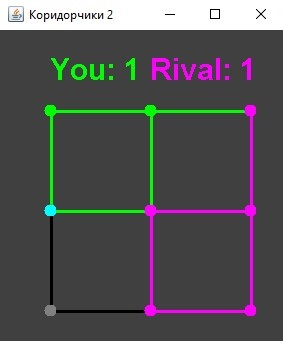

## 1. Game - Corridors. Technology - RMI.
1. Run rmiregistry (from 'src' folder) `start C:\...\rmiregistry.exe`  
1. Run server: `Server.java`  
1. Run clients: `Сlient.java`  

 

## 2. Task - Public Library. Technology - SOAP.
1. Run server: `LibraryService.java`
1. Build remote server class (from 'wsclient\src\main\java' folder):  
`C:\...\wsimport.exe  http://localhost:8080/Library?wsdl -keep`
1. Run client: `ClientApp.java`  

 

